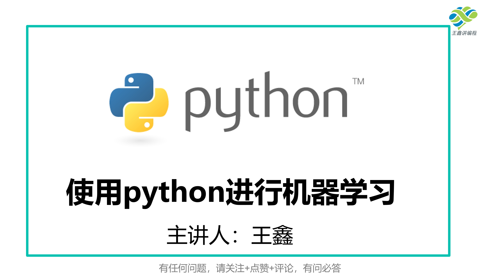

使用 python 进行机器学习

## 配套视频

- [B站](https://space.bilibili.com/16216540/channel/collectiondetail?sid=1954631)

## 课程功能

#### 机器学习的介绍
- 什么是监督学习
- 什么是无监督学习
#### python环境的安装
- Python介绍

#### 简单线性回归
- 什么是简单线性回归

#### 多元线性回归
- 什么是多元线性回归

#### K最近邻算法(KNN)
- 什么是KNN

#### 决策树算法
- 什么是决策树

#### 逻辑回归算法
- 什么是逻辑回归算法

#### 未完待续
- 仓促上线。。。

## 招募

- 本教程和使用介绍，未经过仔细整理，有伙伴想帮助我，可以添加下方我的微信

## 学习交流群

- QQ 群1：618974041

## 我的网站

<h1 align="center"><a href="https://wangxhub.com/" target="_blank"> 知识集 </a></h1>

还未认真梳理编辑，会将讲到的内容，更新到网站上，请持续关注。

## 我的微信：

## 打赏：

